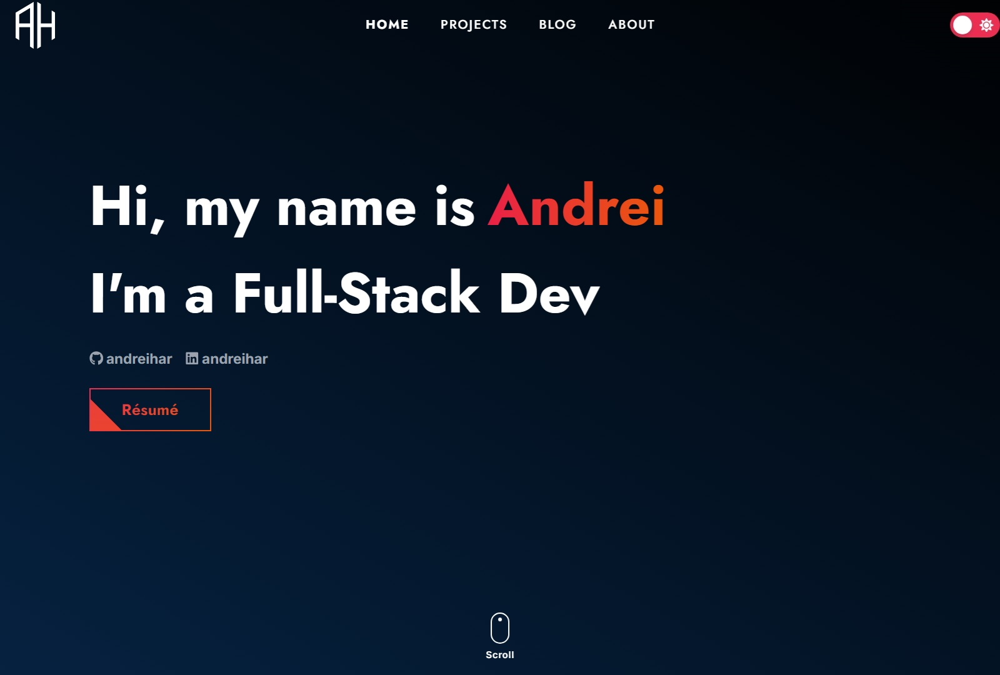
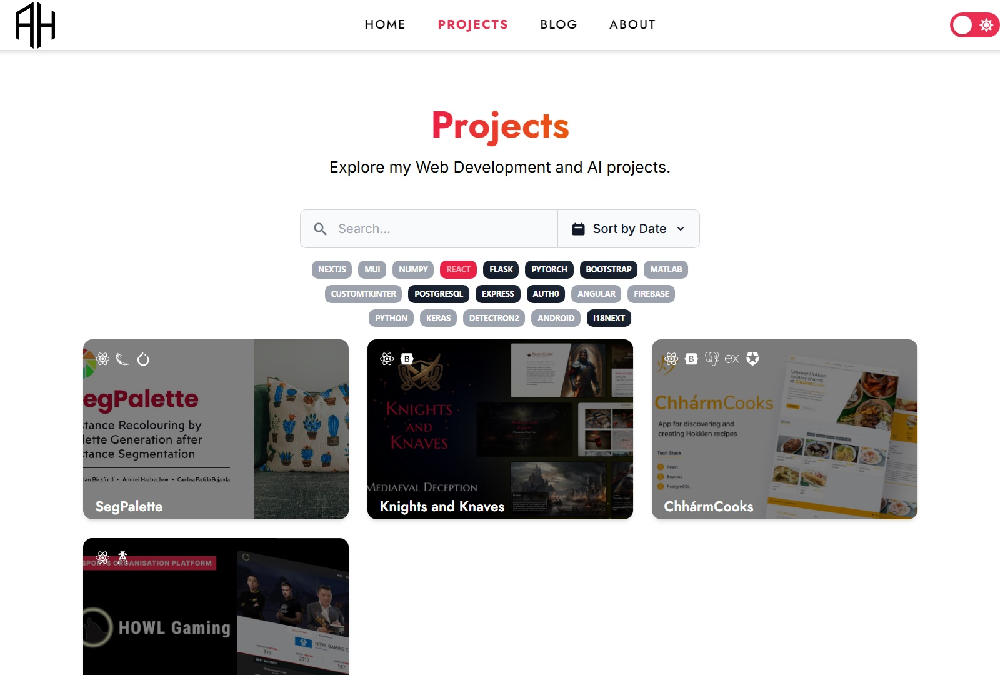
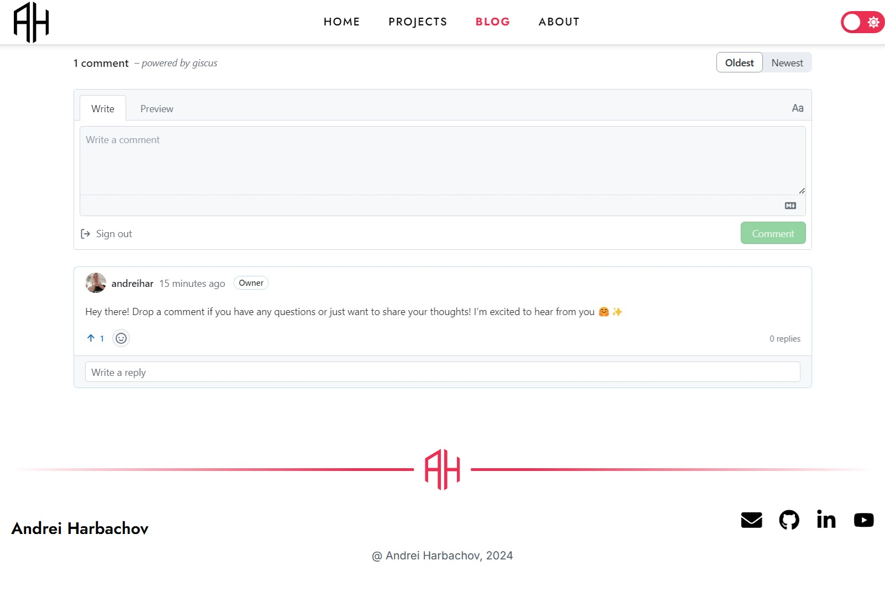
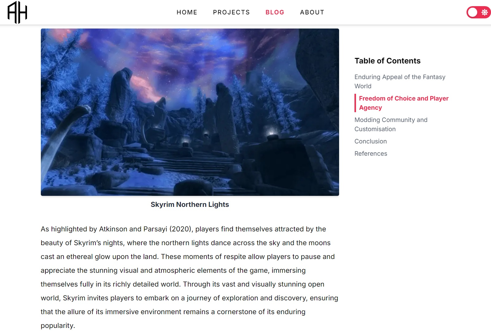
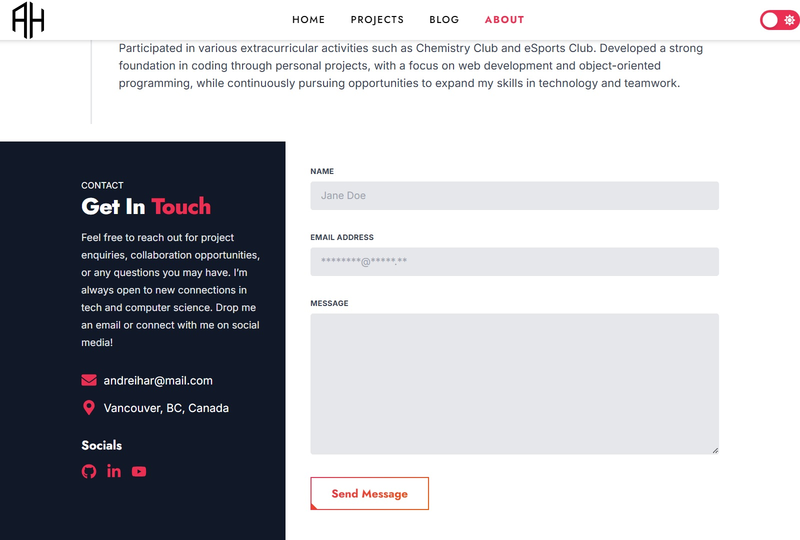
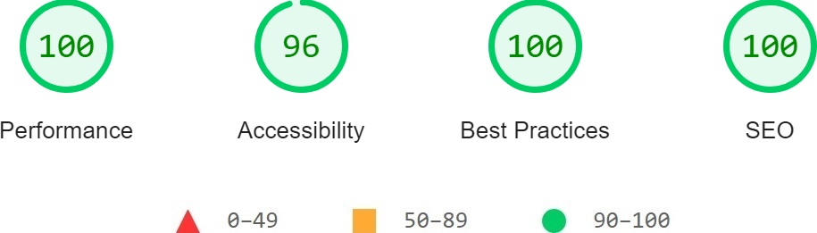

<!-- PROJECT LOGO -->
<div align="center">
  <a href="https://github.com/andreihar/andreihar.com">
    
  </a>
  
# Personal Portfolio


<!-- PROJECT SHIELDS -->
[![Contributors][contributors-badge]][contributors]
[![Licence][licence-badge]][licence]
[![LinkedIn][linkedin-badge]][linkedin]

**A personal portfolio showcasing projects and blog posts, with backend stats tracking for views and likes.**

An innovative portfolio platform built with Next.js, featuring dynamic Projects and Blog sections, an interactive Contact Form, Commenting abilities, and robust Likes and Views tracking powered by Flask serverless functions and Firebase integration.

**[➤ Live Demo][demo]**

</div>


---


<!-- TABLE OF CONTENTS -->
<details open>
  <summary>Table of Contents</summary>
  <ol>
    <li>
      <a href="#about-the-project">About The Project</a>
      <ul>
        <li><a href="#built-with">Built With</a></li>
      </ul>
    </li>
    <li><a href="#install">Install</a></li>
    <li>
      <a href="#features">Features</a>
      <ul>
        <li><a href="#home-page">Home Page</a></li>
        <li><a href="#projects--blog-list">Projects / Blog List</a></li>
        <li><a href="#project--post-pages">Project / Post Pages</a></li>
        <ul>
          <li><a href="#comments">Comments</a></li>
          <li><a href="#table-of-contents">Table of Contents</a></li>
        </ul>
        <li><a href="#contact-me">Contact Me</a></li>
        <li><a href="#likes-and-views">Likes and Views</a></li>
      </ul>
    </li>
    <li><a href="#contributors">Contributors</a></li>
    <li><a href="#licence">Licence</a></li>
  </ol>
</details>

<!-- ABOUT THE PROJECT -->
## About The Project

This personal portfolio is a web application that showcases projects and blog posts. It uses a serverless backend to track and display real-time statistics like views and likes for both projects and blog posts.

The frontend allows users to explore projects by the tech stack used and filter blog posts by tags. The individual project and blog post pages offer an interactive experience with features like a dynamically generated table of contents, real-time like counters, and Giscus-powered comments. Users can also get in touch via a contact form, which sends submissions directly to the email using EmailJS.

### Built With

* [![Next.js][nextjs-badge]][nextjs]
* [![Tailwind CSS][tailwind-badge]][tailwind]
* [![Flask][flask-badge]][flask]
* [![Firebase][firebase-badge]][firebase]

<!-- INSTALL -->
## Install

To run the app locally, you need to set up both the frontend and backend.

**Backend**

```bash
$ cd stats
$ pip install -r requirements.txt
$ cp .env.example .env
```

Fill in the required values for the Firebase in the `.env` file.

```bash
$ python api/index.py
```

**Frontend**

```bash
$ cd client
$ npm install
$ cp .env.example .env
```

Fill in the required values for Cloudinary, EmailJS, and Giscus in the `.env` file.

```bash
$ npm run dev
```

The website can be accessed through the URL `http://localhost:3000/`.


<!-- FEATURES -->
## Features

### Home Page

The Home page serves as the central hub of the portfolio, offering an intuitive overview of projects, blogs, and contact information. It includes an interactive navigation menu that directs users to the specific sections of the portfolio, providing a seamless browsing experience.

<p align="center">

</p>

### Projects / Blog List

The Projects and Blog sections allow users to browse the articles. Projects can be filtered by the tech stack used, while blog posts can be filtered using tag combinations. Both sections feature search functionality to find projects or posts by name and offer sorting options for views, likes, or publishing date.

<p align="center">

</p>

### Project / Post Pages

Each project and blog post has its own dedicated page that offers a detailed presentation of its content. These pages include rich descriptions, embedded media, dynamically updated views and likes count, and interactive features like the table of contents and comments.

<p align="center">

</p>

#### Comments

Users can leave comments on projects or blog posts using Giscus. Comments are automatically linked to the relevant discussions, facilitating engagement without requiring additional setup for individual posts.

<p align="center">

</p>

#### Table of Contents

The table of contents dynamically updates as users scroll through the page, enabling effortless navigation of detailed blog posts or project descriptions.

<p align="center">

</p>

### Contact Me

The Contact Form serves as a direct and efficient communication channel. Users can submit their enquiries or messages by providing their name, email, and a custom message. The form includes validation for all fields, ensuring that submissions are complete and accurate. Upon submission, messages are sent securely using the EmailJS service, which integrates seamlessly with the platform for reliable delivery.

<p align="center">

</p>

### Likes and Views

Tracking of likes and views is powered by serverless functions implemented using Flask, ensuring easy scalability and low-maintenance operation. A Firebase database is used to store and manage data for likes and views, offering real-time updates and reliable storage. It is designed to automatically create database records for new projects and blogs, streamlining the process and eliminating the need for manual setup when adding new content. To enhance security, the feature includes an origin checker that restricts requests to only authorised origins, mitigating potential malicious actions.


<!-- LIGHTHOUSE -->
## Lighthouse Report

<p align="center">

</p>


<!-- CONTRIBUTORS -->
## Contributors

- Andrei Harbachov ([GitHub][andrei-github] · [LinkedIn][andrei-linkedin])


<!-- LICENCE -->
## Licence

Because andreihar.com is MIT-licensed, any developer can essentially do whatever they want with it as long as they include the original copyright and licence notice in any copies of the source code.


<!-- MARKDOWN LINKS -->
<!-- Badges and their links -->
[contributors-badge]: https://img.shields.io/badge/Contributors-1-44cc11?style=for-the-badge
[contributors]: #contributors
[licence-badge]: https://img.shields.io/github/license/andreihar/andreihar.com.svg?color=000000&style=for-the-badge
[licence]: LICENSE
[linkedin-badge]: https://img.shields.io/badge/LinkedIn-0077B5?style=for-the-badge&logo=linkedin&logoColor=white
[linkedin]: https://www.linkedin.com/in/andreihar/
[nextjs-badge]: https://img.shields.io/badge/Next.js-171717?style=for-the-badge&logo=nextdotjs&logoColor=ffffff
[nextjs]: https://nextjs.org/
[tailwind-badge]: https://img.shields.io/badge/Tailwind-06B6D4?style=for-the-badge&logo=tailwindcss&logoColor=white
[tailwind]: https://flask.palletsprojects.com/
[flask-badge]: https://img.shields.io/badge/Flask-000000?style=for-the-badge&logo=flask&logoColor=white
[flask]: https://flask.palletsprojects.com/
[firebase-badge]: https://img.shields.io/badge/Firebase-4c4c4c?style=for-the-badge&logo=firebase&logoColor=FFC400
[firebase]: https://firebase.google.com/

<!-- Technical links -->
[demo]: https://andreihar.com/
[results]: https://www.kaggle.com/datasets/martj42/international-football-results-from-1872-to-2017
[elo]: https://www.eloratings.net/

<!-- Socials -->
[andrei-linkedin]: https://www.linkedin.com/in/andreihar/
[andrei-github]: https://github.com/andreihar